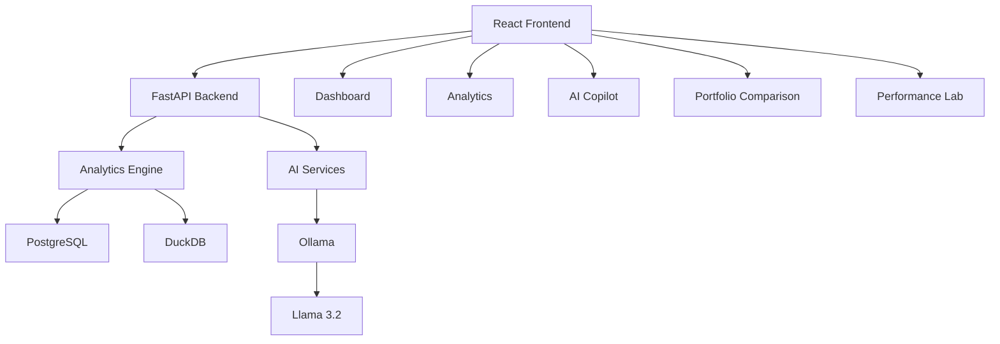

# Investment Risk Analytics Platform

A full-stack investment risk analytics platform that provides portfolio risk monitoring, stress testing, AI-powered risk analysis, portfolio comparison, and analytics benchmarking.

## Overview

This platform helps investment professionals analyze portfolio risk through:

- Portfolio risk metrics
- Portfolio performance tracking
- Sector exposure analysis
- Risk contribution attribution
- Custom stress testing
- AI-powered portfolio analysis
- Portfolio comparison
- Analytics engine benchmarking

## Features

### Dashboard

- Portfolio selection
- Portfolio value tracking
- Annualized return analysis
- Volatility analysis
- Sharpe ratio calculation
- Maximum drawdown monitoring
- Historical VaR monitoring
- Sector allocation visualization

### Analytics

- Holdings analysis
- Risk contribution attribution
- Custom stress testing
- Scenario analysis

### AI Copilot

- AI-generated risk summaries
- Natural language portfolio Q&A
- Conversation memory
- Portfolio insights

### Portfolio Comparison

- Side-by-side portfolio comparison
- Risk metric comparison
- AI-generated portfolio comparison analysis

### Performance Lab

- Analytics engine benchmarking
- PostgreSQL performance testing
- DuckDB performance testing
- Query execution comparison

---

## Architecture

Frontend:
- React
- TypeScript
- Vite
- Recharts
- Axios

Backend:
- FastAPI
- Python

Analytics:
- Pandas
- NumPy

Databases:
- PostgreSQL
- DuckDB

AI:
- Ollama
- Llama 3.2

---

## System Architecture



---

## Project Structure

```text
investment-risk-platform/

backend/
├── app/
│   ├── main.py
│   ├── analytics.py
│   ├── ai_service.py
│   ├── ai_chat.py
│   ├── database.py
│   └── data_loader.py

frontend/
├── src/
│   ├── pages/
│   │   ├── DashboardPage.tsx
│   │   ├── AnalyticsPage.tsx
│   │   ├── AiCopilotPage.tsx
│   │   ├── PortfolioComparisonPage.tsx
│   │   └── PerformanceLab.tsx
│   └── App.tsx
```

---

## Running Locally

### Backend

```bash
cd backend

python -m venv .venv
source .venv/bin/activate

pip install -r requirements.txt

uvicorn app.main:app --reload
```

Backend runs on:

```text
http://127.0.0.1:8000
```

### Frontend

```bash
cd frontend

npm install

npm run dev
```

Frontend runs on:

```text
http://localhost:5173
```

---

## Example Capabilities

### Risk Monitoring

- Portfolio value tracking
- Volatility analysis
- Drawdown analysis
- Historical VaR analysis

### Stress Testing

Example scenario:

```text
Technology      -20%
Semiconductors  -30%
Financials      -10%
ETF             -15%
```

### AI Risk Analysis

Example questions:

- What is the biggest concentration risk?
- Which assets contribute the most risk?
- Is this portfolio sufficiently diversified?
- Summarize this portfolio for a risk committee.

---

## Future Roadmap

### Phase 1
- Portfolio risk analytics
- AI risk analyst
- Portfolio comparison

### Phase 2
- PDF report generation
- Real market data integration
- Historical backtesting

### Phase 3
- Multi-user support
- Portfolio optimization
- Compliance copilot
- Investment intelligence platform

---

## Author

Jia Wei