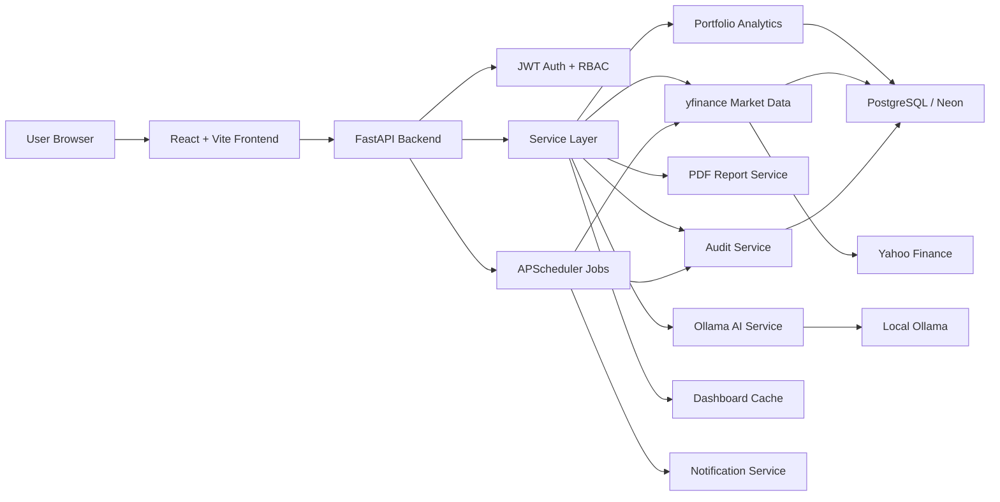

# Investment Risk Analytics Platform

[](https://github.com/itzjiawei/investment-risk-platform/actions/workflows/ci.yml)

## Overview

Investment Risk Analytics Platform is a full-stack application for monitoring portfolio risk. It calculates portfolio value, returns, sector exposure, risk contribution, stress test results, AI-assisted summaries, and PDF reports.

The application is split into a React frontend, a FastAPI backend, and a PostgreSQL database. The backend uses Alembic for schema changes, JWT for authentication, RBAC for endpoint permissions, audit logs for sensitive actions, and APScheduler for background market data refreshes.

## Features

- Portfolio dashboard with consolidated risk, returns, holdings, sector exposure, and risk contribution data.
- Dashboard analytics cache with short TTL and invalidation after market price updates.
- yfinance market data refresh for global and portfolio-specific tickers.
- Display tickers with optional yfinance-compatible ticker mappings.
- Sector exposure and holdings calculations that avoid NaN/Infinity JSON responses.
- Custom stress testing by sector.
- Portfolio comparison and AI-assisted comparison.
- AI Copilot backed by local Ollama, with fallback responses when Ollama is unavailable.
- Downloadable PDF risk reports generated with ReportLab.
- JWT login with password hashing.
- Role-Based Access Control for admin, portfolio manager, analyst, and viewer roles.
- Database-backed audit logs for security and operational actions.
- APScheduler background job for scheduled weekday market refreshes.
- Console-based notification abstraction for scheduled report notifications.
- Backend tests with pytest and FastAPI TestClient.
- GitHub Actions CI for backend tests and frontend builds.
- Deployment configuration for Render, Vercel, and Neon Postgres.

## Technology Stack

| Layer | Tools |
| --- | --- |
| Frontend | React, TypeScript, Vite, Recharts, Axios |
| Backend | FastAPI, Python, Pydantic |
| Database | PostgreSQL, SQLAlchemy, Alembic |
| Analytics | Pandas, NumPy, DuckDB |
| Market data | yfinance, Yahoo Finance |
| AI | Ollama, Llama 3.2 |
| Reports | ReportLab |
| Auth | JWT, passlib, bcrypt |
| Jobs | APScheduler |
| Testing | pytest, FastAPI TestClient |
| Deployment | Render, Vercel, Neon, Docker |
| CI/CD | GitHub Actions |

## Architecture Overview



Backend routes stay thin and call service-layer functions. The database layer centralizes engine configuration, repository queries, and SQLAlchemy models. Alembic owns schema changes, while seed scripts only populate demo data after migrations have run.

See [docs/ARCHITECTURE.md](docs/ARCHITECTURE.md) for diagrams and [docs/ENGINEERING.md](docs/ENGINEERING.md) for folder and service documentation.

## Authentication

The app uses a JWT login flow:

1. Frontend sends credentials to `POST /api/auth/login`.
2. Backend verifies the password using passlib/bcrypt.
3. Backend returns an access token plus user metadata.
4. Frontend stores the token in `localStorage` and sends:

```text
Authorization: Bearer <token>
```

Public endpoints:

- `GET /`
- `POST /api/auth/login`

Protected endpoints require a valid bearer token. Unauthenticated requests return `401 Unauthorized`.

Demo users:

| Email | Password | Role |
| --- | --- | --- |
| `admin@example.com` | `admin123` | `admin` |
| `manager@example.com` | `manager123` | `portfolio_manager` |
| `analyst@example.com` | `analyst123` | `analyst` |
| `viewer@example.com` | `viewer123` | `viewer` |
| `demo@example.com` | `demo123` | `admin` |

Set `JWT_SECRET_KEY` in production through the deployment environment.

## RBAC

| Role | View analytics | AI Copilot | PDF export | Update prices | Audit logs | Users |
| --- | --- | --- | --- | --- | --- | --- |
| `admin` | Yes | Yes | Yes | Yes | Yes | Yes |
| `portfolio_manager` | Yes | Yes | Yes | Yes | No | No |
| `analyst` | Yes | Yes | Yes | No | No | No |
| `viewer` | Yes | No | No | No | No | No |

Authenticated users without the required role receive `403 Forbidden`.

## Audit Logging

Audit logs are stored in the `audit_logs` table. Logged actions include:

- Successful and failed login attempts.
- Market data refreshes.
- PDF report exports.
- AI summary, AI chat, and AI comparison requests.
- Portfolio comparison requests.
- Stress test requests.
- Forbidden RBAC access attempts.
- Admin user-list viewing.
- Background job refresh activity.
- Notification attempts.

Only admins can view:

```text
GET /api/audit-logs
```

Optional filters: `action`, `user_email`, `resource_type`, `status`, and `limit`.

## Background Jobs

The backend uses APScheduler to run a weekday market refresh job. Defaults:

```text
MARKET_REFRESH_ENABLED=true
MARKET_REFRESH_DAYS=mon,tue,wed,thu,fri
MARKET_REFRESH_HOUR_UTC=22
MARKET_REFRESH_MINUTE_UTC=0
```

Admin endpoints:

```text
GET  /api/jobs/status
POST /api/jobs/market-refresh/run-now
```

Render free-tier services can sleep, so the in-process scheduler runs only while the service is awake.

## Dashboard Cache

The consolidated dashboard endpoint caches responses by portfolio ID:

```text
GET /api/portfolio/{portfolio_id}/dashboard
```

The cache stores risk, returns, holdings, sector exposure, and risk contribution data for a short TTL. It is invalidated after successful portfolio or scheduled market refreshes.

## Market Data Pipeline

Demo CSV data is included so the app works without external calls. Market refresh uses yfinance to fetch recent daily close prices for held assets.

Refresh endpoints:

```text
POST /api/market-data/refresh
POST /api/portfolio/{portfolio_id}/market-data/refresh
GET  /api/market-data/status
```

The `assets` table keeps the display `ticker` and optional `yfinance_ticker`. Market refresh downloads data with `yfinance_ticker` when present, but stores prices by `asset_id`, so analytics can still join holdings to prices correctly.

Historical close prices are stored in the `prices` table. The table is keyed by `asset_id` and `date`, which is the database equivalent of ticker/date uniqueness because tickers live in the `assets` table. Re-running a refresh for the same trading date uses PostgreSQL `ON CONFLICT (asset_id, date) DO UPDATE`, so the latest close price is updated in place instead of creating another row. New trading dates are inserted and older history is preserved.

The price table has:

- a uniqueness guard on `(asset_id, date)` through the composite primary key or migration-added unique constraint on older databases
- an index on `date` for latest-date/status lookups

The refresh service batches yfinance downloads and deduplicates yfinance symbols within each refresh. This avoids downloading the same ticker more than once when multiple assets map to the same market symbol. Batch downloads retry with exponential backoff when Yahoo Finance or yfinance raises a transient error such as HTTP 429 rate limiting. If a batched response contains no usable close prices for a ticker, the service retries that ticker through an individual yfinance history request before reporting it as failed.

Retry settings:

```text
YFINANCE_BATCH_SIZE=20
YFINANCE_MAX_RETRIES=2
YFINANCE_RETRY_DELAY_SECONDS=1
```

If a batch or ticker still fails, the service logs the failure, keeps processing the remaining downloaded tickers, and returns diagnostic details in the refresh response. Existing analytics continue to use the latest valid prices already stored in PostgreSQL.

If a ticker fails, the refresh response includes:

```json
{
  "ticker": "DBS",
  "yfinance_ticker": "D05.SI",
  "reason": "No price data returned from yfinance",
  "category": "empty_response",
  "period": "5d",
  "interval": "1d",
  "source": "individual_fallback"
}
```

## PDF Export

PDF reports are generated locally with ReportLab:

```text
GET /api/portfolio/{portfolio_id}/risk-report/pdf
```

Reports include key risk metrics, sector exposure, risk contributors, stress test assumptions, and an AI summary when Ollama is available. If AI is unavailable, the PDF still downloads with a fallback note.

## AI Copilot

AI features use local Ollama by default:

```text
OLLAMA_URL=http://localhost:11434/api/generate
OLLAMA_MODEL=llama3.2:3b
```

Install Ollama and pull the model locally:

```bash
ollama pull llama3.2:3b
```

Hosted Render free-tier deployments usually do not run Ollama locally. In that case AI endpoints return fallback messages and the rest of the platform continues working.

## Database

Main tables:

- `assets`
- `portfolios`
- `holdings`
- `prices`
- `users`
- `audit_logs`

Local PostgreSQL runs through Docker on host port `5433`. Production PostgreSQL is expected to run on Neon through `DATABASE_URL`.

## Alembic Migrations

Alembic controls schema creation and later schema changes.

Run migrations:

```bash
cd backend
../.venv/bin/python -m alembic -c alembic.ini upgrade head
```

Seed demo data after migrations:

```bash
../.venv/bin/python seed_database.py
```

Migrations create tables. Seeding inserts or updates demo data from CSV files. The seed script does not replace entire tables, so refreshed market prices are not wiped during normal reseeding.

## CI/CD

GitHub Actions runs on:

- `push`
- `pull_request`

Jobs:

- Backend: install Python dependencies and run `pytest`.
- Frontend: install npm dependencies and run `npm run build`.

Workflow file:

```text
.github/workflows/ci.yml
```

## Deployment

Deployment targets:

- Frontend: Vercel
- Backend: Render Web Service
- Database: Neon Postgres

Render backend:

```text
Root Directory: backend
Build Command: pip install -r requirements.txt
Start Command: python -m uvicorn app.main:app --host 0.0.0.0 --port $PORT
```

Vercel frontend:

```text
Framework Preset: Vite
Install Command: cd frontend && npm install
Build Command: cd frontend && npm run build
Output Directory: frontend/dist
```

Production environment variables:

Backend on Render:

```text
DATABASE_URL=<Neon Postgres URL>
CORS_ORIGINS=https://your-vercel-app.vercel.app,http://localhost:5173,http://127.0.0.1:5173
DB_SSLMODE=require
JWT_SECRET_KEY=<long random secret>
JWT_EXPIRE_MINUTES=480
OLLAMA_URL=http://localhost:11434/api/generate
OLLAMA_MODEL=llama3.2:3b
YFINANCE_REFRESH_PERIOD=1mo
YFINANCE_BATCH_SIZE=20
YFINANCE_MAX_RETRIES=2
YFINANCE_RETRY_DELAY_SECONDS=1
MARKET_REFRESH_ENABLED=true
MARKET_REFRESH_DAYS=mon,tue,wed,thu,fri
MARKET_REFRESH_HOUR_UTC=22
MARKET_REFRESH_MINUTE_UTC=0
DEMO_USER_EMAIL=demo@example.com
DEMO_USER_PASSWORD=<temporary demo password>
DEMO_USER_FULL_NAME=Demo User
NOTIFICATION_REPORT_RECIPIENTS=
```

Frontend on Vercel:

```text
VITE_API_BASE_URL=https://your-render-service.onrender.com
```

Neon usually requires SSL. This app either uses `sslmode=require` from the URL, applies SSL automatically for `neon.tech` hosts, or honors `DB_SSLMODE=require`.

## Local Setup

Create and activate a virtual environment from the repository root:

```bash
python -m venv .venv
source .venv/bin/activate
```

Install backend dependencies:

```bash
cd backend
../.venv/bin/python -m pip install -r requirements.txt
```

Start PostgreSQL:

```bash
cd ..
docker compose up -d postgres
```

Run migrations and seed demo data:

```bash
cd backend
../.venv/bin/python -m alembic -c alembic.ini upgrade head
../.venv/bin/python seed_database.py
```

Start the backend:

```bash
../.venv/bin/python -m uvicorn app.main:app --reload
```

Start the frontend in another terminal:

```bash
cd frontend
npm install
npm run dev
```

Local URLs:

```text
Backend:  http://127.0.0.1:8000
Frontend: http://localhost:5173
```

Windows PowerShell virtualenv activation:

```powershell
.\.venv\Scripts\Activate.ps1
```

## Production Deployment

1. Create a Neon Postgres database.
2. Set Render `DATABASE_URL` to the Neon connection string.
3. Set Render `JWT_SECRET_KEY` to a strong secret.
4. Set Render `CORS_ORIGINS` to include the exact Vercel frontend URL.
5. Deploy the Render backend.
6. Run Alembic migrations against Neon.
7. Seed demo data if needed.
8. Set Vercel `VITE_API_BASE_URL` to the Render backend URL.
9. Deploy the Vercel frontend.
10. Verify `GET /`, login, dashboard load, PDF export, and market refresh.

## API Overview

Core:

```text
GET  /
GET  /api/portfolios
GET  /api/portfolio/{portfolio_id}/dashboard
GET  /api/portfolio/{portfolio_id}/risk
GET  /api/portfolio/{portfolio_id}/returns
GET  /api/portfolio/{portfolio_id}/holdings
GET  /api/portfolio/{portfolio_id}/sector-exposure
GET  /api/portfolio/{portfolio_id}/risk-contribution
POST /api/portfolio/{portfolio_id}/stress-test
POST /api/portfolio/compare
```

Auth and admin:

```text
POST /api/auth/login
GET  /api/auth/me
GET  /api/auth/users
GET  /api/audit-logs
```

Market data and jobs:

```text
POST /api/market-data/refresh
POST /api/portfolio/{portfolio_id}/market-data/refresh
GET  /api/market-data/status
GET  /api/jobs/status
POST /api/jobs/market-refresh/run-now
```

AI, reports, performance, notifications:

```text
POST /api/portfolio/{portfolio_id}/ai-risk-summary
POST /api/portfolio/{portfolio_id}/ask-ai
POST /api/portfolio/compare-ai
GET  /api/portfolio/{portfolio_id}/risk-report/pdf
GET  /api/portfolio/{portfolio_id}/value-fast
GET  /api/portfolio/{portfolio_id}/engine-comparison
GET  /api/performance/large-benchmark
POST /api/notifications/send-report
```
