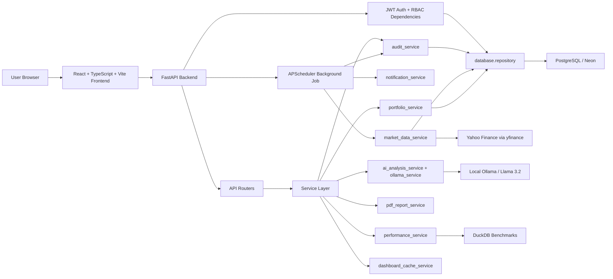
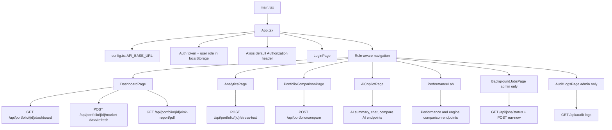
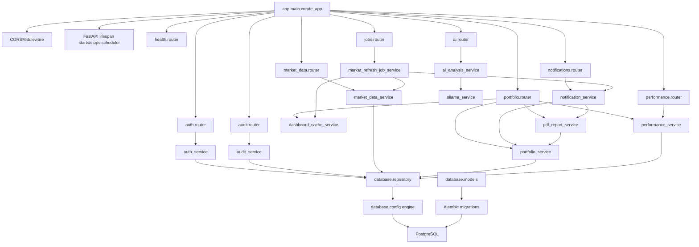
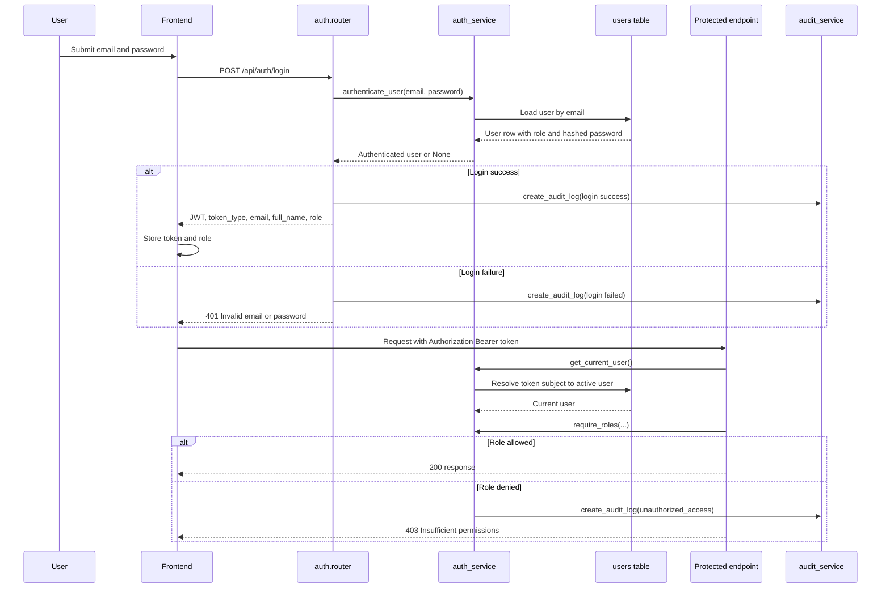
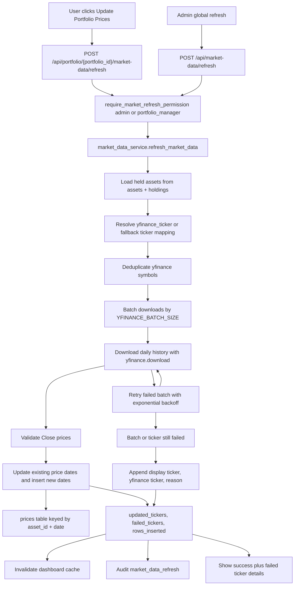
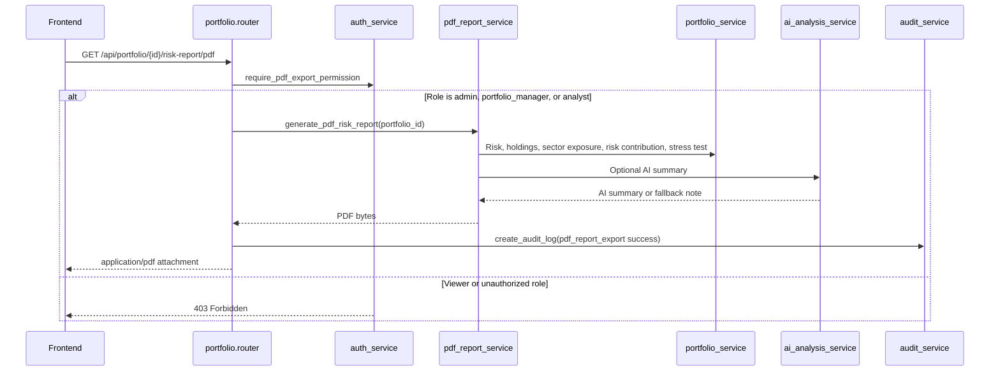
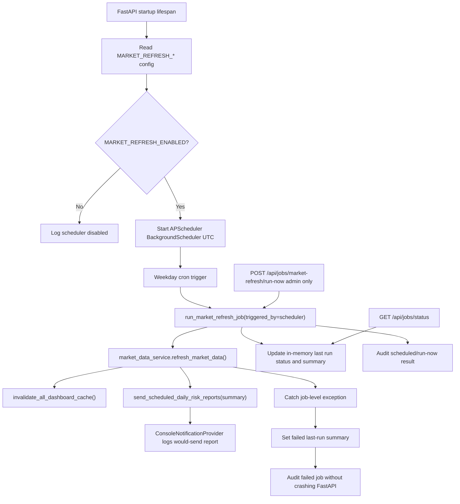
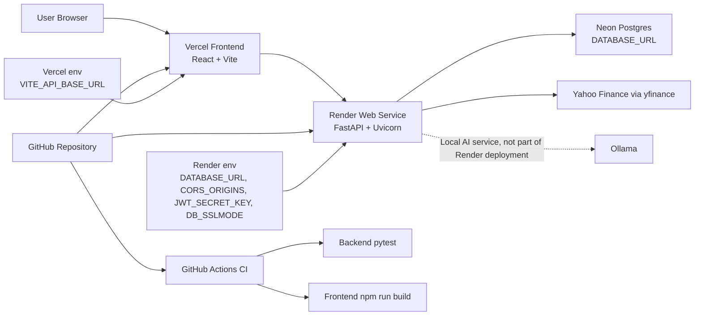
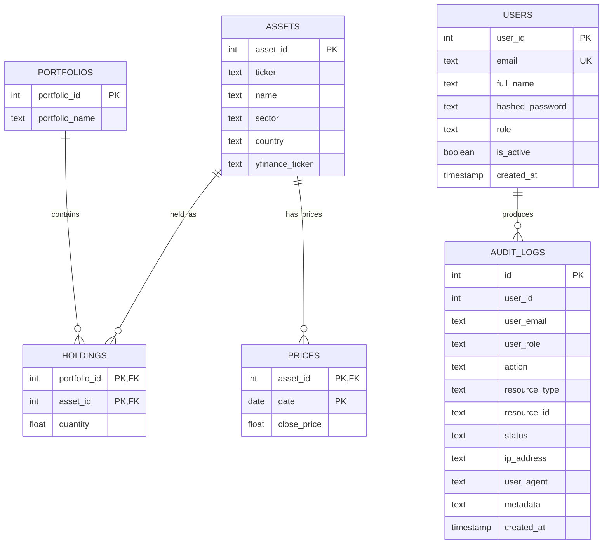

# Architecture Diagrams

This document describes the current architecture of the Investment Risk Analytics Platform. Diagrams use Mermaid so they render directly on GitHub.

## 1. Overall System Architecture

## 2. Frontend Page Architecture

## 3. Backend Router, Service, and Database Architecture

## 4. Authentication and RBAC Flow

## 5. Market Data Refresh Flow

## 6. PDF Export Flow

## 7. Background Scheduler Flow

## 8. Deployment Architecture: Vercel to Render to Neon

## 9. Database and Table Relationship Overview

Note: `audit_logs.user_id` is stored for traceability but is not currently declared as a database-level foreign key in the migration.
